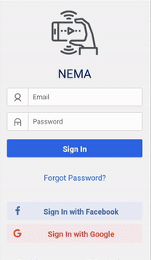
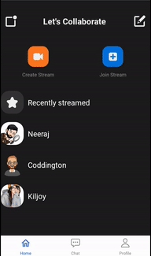
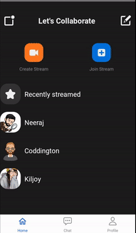
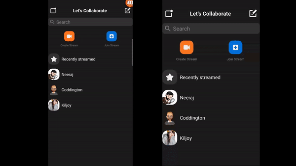

# NEMA: A Collaborative Video Streaming App


.
.
.
.
## Course Name : Mobile and Pervasive Computing
## Instructor: Dr. Suchetana Chakraborty 

## Team
| Name                                            | Year      | Department                       |
| ----------------------------------------------- | --------- | -------------------------------- |
| [Maruf Hussain](https://github.com/stalker-john) | 3rd Year | Computer Science And Engineering |
| [Neeraj Anand](https://github.com/neeraj-2) | 3rd Year | Computer Science And Engineering |


## How to run app using on your real/virtual device
```sh
1.clone the repositore using `git clone github.com/Mobile-and-Pervasive-Computing-Projects/course-projects-neeraj-2.git `
2.Change directory to the folder.
cd Mobile-and-Pervasive-Computing-Projects/course-projects-neeraj-2
4.Now install all the node dependecies
npm install
5.Start metro server using
npm run start
6.Now install the app on your device using
npx react-native run-android
```


.
.
.
.
## About our app

This is a collaborative video streaming application using socket.io and webrtc. Uisng it a user can do live-stream via P2P connection among streamers and viewers. A user just needs to create a room by providing a room name and an ID, further others users can join the stream using the same roomID.

Here are some of the screens of our app:

- Onboarding Screens

Here are the onboarding screens of our app, where users can get an idea of the application 

 
 
 <hr/>


- Signup/Login Screen

We have integrated **Google auth**, **Facebook auth** to our application. Thus if a user has an authorized google accounthe/she can sign in to our application using the same. Now let's say a user does not have the same. Then for that, we have integrated **firebase auth**. So a user can simply create an account on our app and he/she can further use our app by logging in using the same credentials. For implementing these functioanities we have used firebase/DB, firebase/auth, firebase/storage react-native utilities.


  
  
  
  <hr/>
  
- Home Screen
  
  Here is the home screen of our app, where users can navigate to different tabs like `chat`, `Profile`. They can also click the tabs `create stream` or `join stream` to have a connection with their friends. 
  
   
   
   
   <hr/>

- User Profile Screens

Here are the user profile screen where user can view his/her own profile. He can click `edit` tab and also can edit his/her own profile. By clicking on  logout button, he/she will be logged out from the application 


<hr/>

- Chatbot screen

Here is the chatbot screen of our application which is built using Dialogflow. It basically enhances user-experience for our aplication


<hr/>

- Create Stream 

Here is the screen using which a user can create a  roomname  and  roomID. Once user creates a room id, we are creating a signaling server using  socket.io  and that server is creating a broadcast using WebRTC through which a user can stream and others can join him/her using the same roomID


<hr/>

- Streaming Screens

Here, we can see Maruf(one of our users) is starting the stream and on the other phone Neeraj(another user) is joining the stream using the same RoomID. And Neeraj can see the stream from Maruf. Also we can see viewers count getting increased to 1 in realtimw. All this is happening via socket.io signaling server and Webrtc p2p connection:





.
.
.
.

.
### Implementation:
1. Firstly we created simple UI screens and added navigation b/w them using different react-native utilities.
2. Then we integrated firebase auth, google-auth and facebook auth using firebase/db, firebase/auth, and firebase/storage.
3. Further we integrated webrtc and socket.io for p2p video-exchange b/w streamers and users.
3. Further we tested our app on real device as well as virtual devices/emulators.


### Demo Link:

- https://www.youtube.com/watch?v=3djEbzmBI-I


